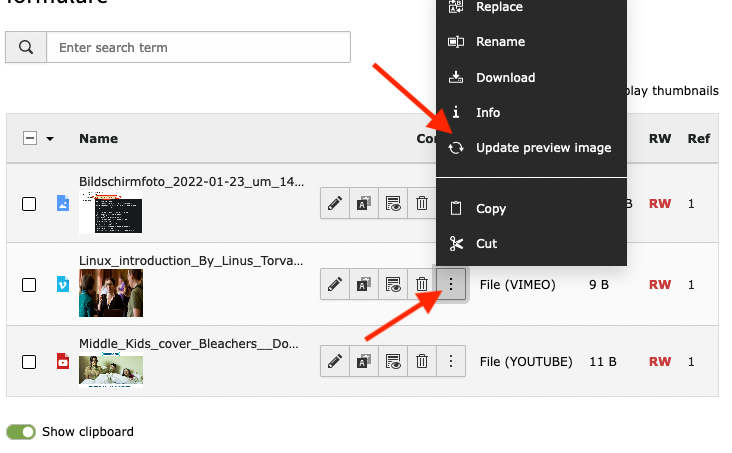

# EXT:online_media_updater - A TYPO3 Extension for updating YouTube/Vimeo preview images

## Features
 * Update YouTube/Vimeo preview images
 * Remove processed images
 * Update image dimensions



## Installation

Install this extension via `composer req b13/online-media-updater`. In v10 activate the extension in the Extension Manager of your TYPO3 installation.

Once installed, an "Update preview image" button is available for *.youtube and *.vimeo files in the filelist.

## Events

### Register custom media extension for metadata update

First register an EventListener for OnlineMediaHelper in your services.yaml

```
  Vendor\Extension\EventListener\ModifyOnlineMediaHelperEventListener:
    tags:
      - name: event.listener
        identifier: 'your-custom-identifier'
        event: B13\OnlineMediaUpdater\Event\ModifyOnlineMediaHelperEvent
```

Afterwards, we will hand over our own OnlineMediaHelper to the event.

```
namespace Vendor\Extension\EventListener;

use B13\OnlineMediaUpdater\Event\ModifyOnlineMediaHelperEvent;
use TYPO3\CMS\Core\Utility\GeneralUtility;
use Vendor\Extension\Helper\YourHelper;

class ModifyOnlineMediaHelperEventListener
{
    public function __invoke(ModifyOnlineMediaHelperEvent $event): void
    {
        $onlineMediaHelper = GeneralUtility::makeInstance(YourHelper::class, 'file_extension');
        $event->setOnlineMediaHelper($onlineMediaHelper);
    }
}
```

### Register custom fields for metadata update

First register an EventListener for MetaData in your services.yaml

```
  Vendor\Extension\EventListener\ModifyMetaDataEventListener:
    tags:
      - name: event.listener
        identifier: 'your-custom-identifier'
        event: B13\OnlineMediaUpdater\Event\ModifyMetaDataEvent
```

In the EventListener you can now set your own fields or overwrite existing values.

```
namespace Vendor\Extension\EventListener;

use B13\OnlineMediaUpdater\Event\ModifyMetaDataEvent;

class ModifyMetaDataEventListener
{
    public function __invoke(ModifyMetaDataEvent $event): void
    {
        $metaData = $event->getMetaData();
        $metaData['title'] = 'My custom title';
        $metaData['new_field'] = 'My new fields';

        $event->setMetaData($metaData);
    }
}
```

## Todo
 * [] Pre-process images like backend thumbnails
 * [] Allow update of other metadata e.g. title

## Credits

This extension was created by Jochen Roth in 2022 for [b13 GmbH, Stuttgart](https://b13.com).

[Find more TYPO3 extensions we have developed](https://b13.com/useful-typo3-extensions-from-b13-to-you) that help us deliver value in client projects. As part of the way we work, we focus on testing and best practices to ensure long-term performance, reliability, and results in all our code.
